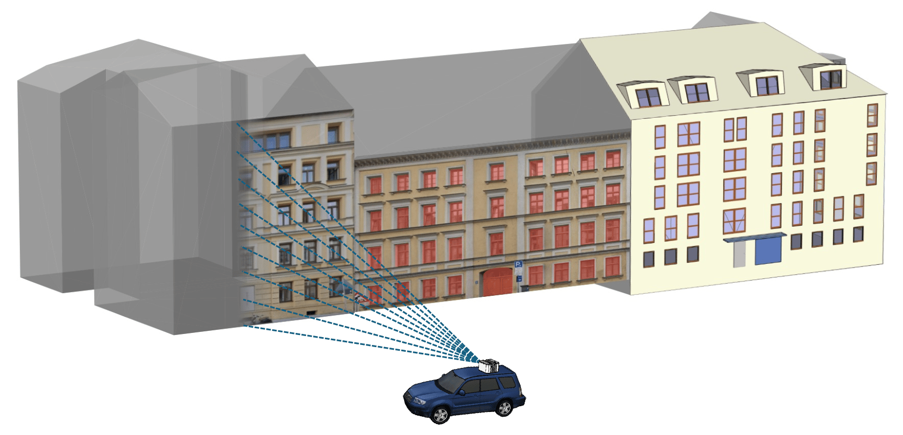

# Texture2LoD3: Enabling LoD3 Building Reconstruction With Panoramic Images Official implementation of the paper

Texture2LoD3 proposes leveraging ubiquitous street-level images and low-level building models for accurate ortho-texturing (left): Enabling accurate semantic segmentation (center) and facade-rich LoD3 reconstruction (right).

**Texture2LoD3: Enabling LoD3 Building Reconstruction With Panoramic Images** 
Wenzhao Tang, Weihang Li, Xiucheng Liang, Olaf Wysocki, Filip Biljecki, Christoph Holst, Boris Jutzi 
https://wenzhaotang.github.io/Texture2LoD3/  

Abstract: *Despite recent advancements in surface reconstruction, Level of Detail (LoD) 3 building reconstruction remains an unresolved challenge. The main issue pertains to the object-oriented modelling paradigm, which requires georeferencing, watertight geometry, facade semantics, low-poly representation, and starkly contrasting unstructured mesh-oriented models. In Texture2LoD3, we introduce a novel method leveraging the ubiquity of 3D building model priors and panoramic street-level images, enabling the reconstruction of LoD3 building models. We observe that prior low-detail building models can serve as valid planar targets for ortho-rectifying street-level panoramic images. Moreover, deploying segmentation on rectified images on low-level building surfaces supports maintaining essential georeferencing, watertight geometry, and low-poly representation for LoD3 reconstruction. In the absence of LoD3 validation data, we additionally introduce the ReLoD3 dataset, on which we experimentally demonstrate that our method leads to improved facade segmentation accuracy by 11% and can replace costly manual projections. We believe that Texture2LoD3 can scale the adoption of LoD3 models, opening applications in estimating building solar potential or enhancing autonomous driving simulations.*

 

### Source Code Coming Soon!